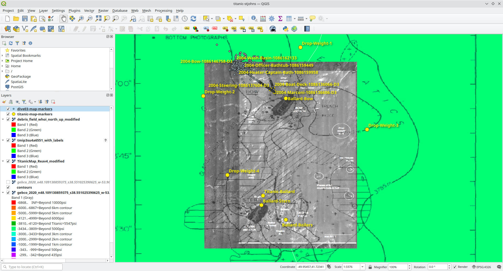

# Titanic debris field map

This project is an attempt to collect various maps and scans of the Titanic wreck site and georeference them
against known locations with exact lat-long coordinates. The project was created in QGIS and you can edit
the underlying maps and markers there in the titanic-stjohns.qgs file.

For more information visit [https://waynepiekarski.net/projects/titanic-map.htm](https://waynepiekarski.net/projects/titanic-map.htm), and
there is a [web preview](https://waynepiekarski.net/projects/titanic-map/export-openlayers/)
for those who want to just look at the maps and not make changes.

# License

This project's QGIS files and other metadata are licensed under CC BY-SA https://creativecommons.org/licenses/by-sa/4.0/

Creative Commons Attribution-ShareAlike 4.0 International Public License

# References

The images referenced are copyrighted by their various authors and available for download at the following locations:

https://www.whoi.edu/multimedia/the-original-titanic-map/
https://www.whoi.edu/oceanus/feature/the-quest-to-map-titanic/
WHOI researchers Bob Ballard, Elazar Uchupi, and William Lange created this first map of the Titanic wreck site based on images collected during two WHOI expeditions in 1985 and 1986. It was published in 1988 and was the most complete map until the new one was completed after the 2010 expedition.
debris_field_whoi.jpg

https://www.gc.noaa.gov/documents/2012/012512-maritime_day.pdf
https://www.gc.noaa.gov/documents/2012/013112_gcil_mepc1-circ779.pdf
Contains list of weight drop zone locations along with a chart relative to the wreck site
012512-maritime_day.jpg
013112_gcil_mepc1-circ779.jpg

https://web.archive.org/web/20230630091432/https://www.encyclopedia-titanica.org/community/threads/proper-debris-field-mapping-and-where-to-find-it.52830/
1603985732138 English.png
1603985732138 Original.png
Debris Field Map 1.JPG

Titanic: Destination Disaster : the Legends and the Reality. John P. Eaton, Charles A. Haas, 1996.
https://books.google.com/books?id=iLI43mWtZRkC&lpg=PA180&ots=8o9Bbx-K2k&dq=49%C2%B0%2056%E2%80%B2%2049%E2%80%B3%20W%2C%2041%C2%B0%2043%E2%80%B2%2032%E2%80%B3%20N%20boilers&pg=PA180#v=onepage&q&f=true
eaton-haas-ballard-titanic-coordinates.png

https://www.whoi.edu/multimedia/titanic-in-a-new-light/
titanic-mosaic-bow.jpg
titanic-mosaic-stern.jpg

Google Images?
tmip3su4a6551.jpg

https://web.archive.org/web/20201203103311/https://www.sunjournal.com/2012/03/09/full-titanic-wreck-site-mapped-first-time/
TitanicMap_Reav1.jpg
TitanicMap_Reav2.jpg
TitanicMap_Reav3.jpg
TitanicMap_Reav4.jpg

# NOAA 2004 expedition archive

This data contains 3D positioning coordinates from the ROV, and this data has been cleaned up and added as markers on the map. These markers are also
labelled and match with the transcript of the recorded videos from the mission. Unfortunately the tracking data seems to drift so much that the positioning
information is not useful.

https://www.ncei.noaa.gov/maps/oer-digital-atlas/mapsOE.htm?lat=1&lng=125&zoom=7&survey=Titanic%252520Expedition%2525202004 and search for “Titanic”. It shows two missions from 2003 and 2004, and it includes extra metadata including the lat-long coordinates of each vehicle, as well as a transcript of what the vehicle was looking at.
2004 complete archive: https://www.ncei.noaa.gov/archive/archive-management-system/OAS/bin/prd/jquery/download/72311.1.1.tar.gz

Hercules is the NOAA ROV, and Argus is a support vehicle that floats above holding the fiber tether.
For this git repo: I removed all the surface ship and Argus data, as well as the raw sensor data for the water conditions, and just kept the 3D track and event log.
